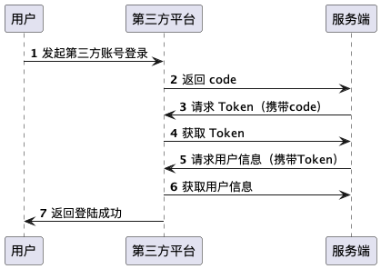
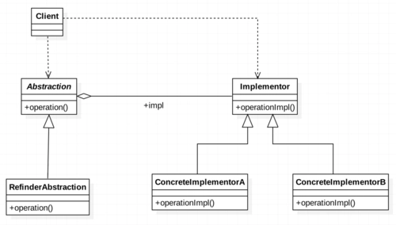

# 第二章 多种类第三方账号登录-桥接模式和适配器模式
## 1 初始化项目
[项目目录](src/main/java/com/mint/learn/designpattern/bridgeadapter)

### 1.1 controller
```java
@RestController
@RequestMapping("/v1/user")
public class UserController {
    @Resource
    private UserService userService;

    @PostMapping("/login")
    public String login(String account, String password) {
        return userService.login(account, password);
    }

    @PostMapping("/register")
    public String login(@RequestBody UserInfo userInfoPO) {
        return userService.register(userInfoPO);
    }
}
```

### 1.2 service
```java
@Service
public class UserServiceImpl implements UserService {
    @Resource
    private UserInfoDao userInfoDao;

    @Override
    public String login(String account, String password) {
        UserInfo userInfoPO = userInfoDao.selectByUsernameAndPassword(account, password);
        if (userInfoPO == null) {
            return "account/password error";
        }
        return "login success";
    }

    @Override
    public String register(UserInfo userInfoPO) {
        if (checkUserExists(userInfoPO.getUsername())) {
            throw new RuntimeException("user already registered");
        }
        userInfoPO.setCreateTime(LocalDateTime.now());
        userInfoDao.insert(userInfoPO);
        return "register success";
    }

    private boolean checkUserExists(String username) {
        UserInfo userInfoPO = userInfoDao.selectByUsername(username);
        if (userInfoPO == null) {
            return false;
        }
        return true;
    }
}
```

### 1.3 po
```java
@Data
public class UserInfoPO {
    private Long id;

    private String username;

    private String password;

    private LocalDateTime createTime;

    private String email;
}
```
## 2 需求
> 1. 增加第三方账号登录
> 2. 自动注册第三方账户信息，账号前面添加第三方平台信息，如Git@xiaoli
> 3. 分别用扩展（适配器模式）和重构（桥接模式）实现

## 3 适配器模式
### 3.1 UML类结构分解及方法定义

> 适配器模式，使不兼容的接口变得兼容，将类自己的接口包裹在一个已存在的类中，分为对象适配器模式和类适配器模式
> - 对象适配器模式：适配器关联一个它包裹的类的实例
> - 类适配器模式：适配器继承被4适配的类
#### 3.1.1 类设计
##### a.Adaptee
被适配角色，即初始化项目中的UserService

##### b.Adapter
通过继承复用Adapee逻辑
```java
@Component
public class Login3rdAdapter extends UserServiceImpl {
}
```
##### c.Target
添加的第三方登录功能接口
```java
public interface Login3rdTarget {
    String loginByGitee(String code, String state);
    
    String loginByWechat(String... args);
    
    String loginByQQ(String... args);
}
```

##### d.最终适配器
```java
@Component
public class Login3rdAdapter extends UserServiceImpl implements Login3rdTarget {
    @Override
    public String loginByGitee(String code, String state) {
        return null;
    }

    @Override
    public String loginByWechat(String... args) {
        return null;
    }

    @Override
    public String loginByQQ(String... args) {
        return null;
    }
}
```

### 3.2 三方登录实战
#### 3.2.1 三方登录流程

1. 用户点击三方登录图标向三方平台发起账号登录请求
如：https://gitee.com/oauth/authorize?client_id=6544813bfb0d6cf06d333449b4f5a40b3267f191e34e1bd10a9f964156748e4c&redirect_uri=http://localhost:8081/v1/user/gitee&response_type=code&state=GITEE
- client_id: gitee为个人或企业授权的唯一ID标识
- redirect_uri: 当三方平台验证client_id为授权id时，会向该地址发起回调请求（不在前端拼接，保存在后端）
- response_type: gitee平台在回调uri时会携带code参数
- state: 随机字符串或提前订好的一个值，收到三方回调state后校验是否完全一致
```java
@RestController
@RequestMapping("/v1/user")
public class UserController {
    @Resource
    private Login3rdAdapter login3rdAdapter;

    @GetMapping("/gitee")
    public String gitee(String code, String state) {
        return login3rdAdapter.loginByGitee(code, state);
    }

}
```
2. 返回code
3. 请求Token
获取code后，继续向/oauth/token接口获取token
如：https://gitee.com/oauth/token?grant_type=authorization_code&client_id=6544813bfb0d6cf06d333449b4f5a40b3267f191e34e1bd10a9f964156748e4c&client_secret=2aadb58abac976a548429475c22b281a9132646765c5c674246e30878a83fd5e&code=xxx&redirect_uri=http://localhost:8081/v1/user/gitee
- grant_type=authorization_code: 使用第二步获取的code进行验证
- client_id: 与前面一致
- client_secret: 授权密码
- redirect_uri：与前面一致，gitee不会回调，只是验证
4. 获取token
5. 请求用户信息
向gitee请求获取用户信息
如：https://gitee.com/api/v5/user?access_token=xxxx
6. 得到用户的信息，进行自动注册和登录
7. 返回登录成功
#### 3.2.2 三方登录代码
三方配置
```yaml
gitee:
  clientId: 6544813bfb0d6cf06d333449b4f5a40b3267f191e34e1bd10a9f964156748e4c
  clientSecret: 2aadb58abac976a548429475c22b281a9132646765c5c674246e30878a83fd5e
  callback: http://localhost:8081/v1/user/gitee
  state: GITEE
  user:
    prefix: ${gitee.state}@
    url: https://gitee.com/api/v5/user?access_token=
  token:
    url: https://gitee.com/oauth/token?grant_type=authorization_code&client_id=${gitee.clientId}&client_secret=${gitee.clientSecret}&redirect_uri=${gitee.callback}&code=
```
httpClientUtil类
```java
public class HttpClientUtil {
    public static JSONObject execute(String url, HttpMethod httpMethod) {
        HttpRequestBase http = null;
        try {
            HttpClient client = HttpClients.createDefault();
            if (httpMethod == HttpMethod.GET) {
                http = new HttpGet(url);
            } else if (httpMethod == HttpMethod.POST) {
                http = new HttpPost(url);
            }
            HttpEntity entity = client.execute(http).getEntity();
            return JSONObject.parseObject(EntityUtils.toString(entity));
        } catch (IOException e) {
            throw new RuntimeException("request failed. url = " + url);
        } finally {
            if (http != null) {
                http.releaseConnection();
            }
        }
    }
}
```
三方登录类
```java
@Component
public class Login3rdAdapter extends UserServiceImpl implements Login3rdTarget {
    @Value("${gitee.state}")
    private String giteeState;
    @Value("${gitee.token.url}")
    private String giteeTokenUrl;
    @Value("${gitee.user.url}")
    private String giteeUserUrl;
    @Value("${gitee.user.prefix}")
    private String giteeUserPrefix;

    @Override
    public String loginByGitee(String code, String state) {
        if (!giteeState.equals(state)) {
            throw new UnsupportedOperationException("Invalid state");
        }
        String tokenUrl = giteeTokenUrl.concat(code);
        JSONObject tokenResponse = HttpClientUtil.execute(tokenUrl, HttpMethod.POST);
        String token = String.valueOf(tokenResponse.get("access_token"));
        String userUtl = giteeUserUrl.concat(token);
        JSONObject userResponse = HttpClientUtil.execute(userUtl, HttpMethod.GET);
        String userName = giteeUserPrefix.concat(String.valueOf(userResponse.get("name")));
        return autoRegister3rdAndLogin(userName, userName);
    }

    private String autoRegister3rdAndLogin(String userName, String password) {
        if (super.checkUserExists(userName)) {
            return super.login(userName, password);
        }
        UserInfoPO userInfoPO = new UserInfoPO();
        userInfoPO.setUsername(userName);
        userInfoPO.setPassword(password);
        userInfoPO.setCreateTime(LocalDateTime.now());
        super.register(userInfoPO);
        return super.login(userName, password);
    }
}
```

## 4 桥接模式
### 4.1 UML类图

#### 4.1.1 接口
```java
public interface RegisterLoginFuncInterface {
    String login(String account, String password);
    String register(UserInfoPO userInfoPO);
    boolean checkUserExists(String username);
    // 不同三方登录平台回调的参数不同，因此使用HttpServletRequest
    String login3rd(HttpServletRequest request);
}
```
#### 4.1.2 接口的具体实现
> 1. 默认登录
> 2. gitee登录
> 3. 微信登录
> 4. qq登录
这里只实现默认登录和gitee登录

```java
@Component
public class RegisterLoginByDefault implements RegisterLoginFuncInterface {
    @Resource
    private UserInfoDao userInfoDao;
    
    @Override
    public String login(String account, String password) {
        return null;
    }

    @Override
    public String register(UserInfoPO userInfoPO) {
        return null;
    }

    @Override
    public boolean checkUserExists(String username) {
        return false;
    }

    @Override
    public String login3rd(HttpServletRequest request) {
        return null;
    }
}
```

ps: 默认登录不需要实现login3rd方法，gitee登录也不需要实现login、register方法，具体修改见下

#### 4.1.3 抽象角色，为调用端提供方法入口
```java
public abstract class AbstractRegisterLoginComponent {
    public abstract String login(String username, String password);
    public abstract String register(UserInfoPO userInfoPO);
    public abstract boolean checkUserExists(String username);
    public abstract String login3rd(HttpServletRequest request);
}
```
ps: 看起来和接口很像，不是冗余，用抽象和实现换去高扩展性

#### 4.1.4 抽象角色子类
```java
public class RegisterLoginComponent extends AbstractRegisterLoginComponent{
    @Override
    public String login(String username, String password) {
        return null;
    }

    @Override
    public String register(UserInfoPO userInfoPO) {
        return null;
    }

    @Override
    public boolean checkUserExists(String username) {
        return false;
    }

    @Override
    public String login3rd(HttpServletRequest request) {
        return null;
    }
}
```

#### 4.1.5 为抽象类和桥接类搭建桥梁
**抽象类**
```java
public abstract class AbstractRegisterLoginComponent {
    protected RegisterLoginFuncInterface funcInterface;
    public AbstractRegisterLoginComponent(RegisterLoginFuncInterface funcInterface) {
        validate(funcInterface);
        this.funcInterface = funcInterface;
    }

    private void validate(RegisterLoginFuncInterface funcInterface) {
        if (funcInterface == null) {
            throw new UnsupportedOperationException("register/login function is null");
        }
    }

    public abstract String login(String username, String password);
    public abstract String register(UserInfoPO userInfoPO);
    public abstract boolean checkUserExists(String username);
    public abstract String login3rd(HttpServletRequest request);
}
```

**实现类**
```java
public class RegisterLoginComponent extends AbstractRegisterLoginComponent{
    public RegisterLoginComponent(RegisterLoginFuncInterface funcInterface) {
        super(funcInterface);
    }

    @Override
    public String login(String username, String password) {
        return funcInterface.login(username, password);
    }

    @Override
    public String register(UserInfoPO userInfoPO) {
        return funcInterface.register(userInfoPO);
    }

    @Override
    public boolean checkUserExists(String username) {
        return funcInterface.checkUserExists(username);
    }

    @Override
    public String login3rd(HttpServletRequest request) {
        return funcInterface.login3rd(request);
    }
}
```

### 4.2 三方登录代码
4.2.1 子类实现

**RegisterLoginByDefault**
```java
@Component
public class RegisterLoginByDefault implements RegisterLoginFuncInterface {
    @Resource
    private UserInfoDao userInfoDao;

    @Override
    public String login(String account, String password) {
        UserInfoPO userInfoPO = userInfoDao.selectByUsernameAndPassword(account, password);
        if (userInfoPO == null) {
            return "account/password error";
        }
        return "login success";
    }

    @Override
    public String register(UserInfoPO userInfoPO) {
        if (checkUserExists(userInfoPO.getUsername())) {
            throw new RuntimeException("user already registered");
        }
        userInfoPO.setCreateTime(LocalDateTime.now());
        userInfoDao.insert(userInfoPO);
        return "register success";
    }

    public boolean checkUserExists(String username) {
        UserInfoPO userInfoPO = userInfoDao.selectByUsername(username);
        if (userInfoPO == null) {
            return false;
        }
        return true;
    }

    @Override
    public String login3rd(HttpServletRequest request) {
        return null;
    }
}
```

**RegisterLoginByGitee**
```java
@Component
public class RegisterLoginByGitee implements RegisterLoginFuncInterface {
    @Value("${gitee.state}")
    private String giteeState;
    @Value("${gitee.token.url}")
    private String giteeTokenUrl;
    @Value("${gitee.user.url}")
    private String giteeUserUrl;
    @Value("${gitee.user.prefix}")
    private String giteeUserPrefix;
    
    @Resource
    private UserInfoDao userInfoDao;

    @Override
    public String login(String account, String password) {
        UserInfoPO userInfoPO = userInfoDao.selectByUsernameAndPassword(account, password);
        if (userInfoPO == null) {
            return "account/password error";
        }
        return "login success";
    }

    @Override
    public String register(UserInfoPO userInfoPO) {
        if (checkUserExists(userInfoPO.getUsername())) {
            throw new RuntimeException("user already registered");
        }
        userInfoPO.setCreateTime(LocalDateTime.now());
        userInfoDao.insert(userInfoPO);
        return "register success";
    }

    public boolean checkUserExists(String username) {
        UserInfoPO userInfoPO = userInfoDao.selectByUsername(username);
        if (userInfoPO == null) {
            return false;
        }
        return true;
    }
    @Override
    public String login3rd(HttpServletRequest request) {
        String state = request.getParameter("state");
        String code = request.getParameter("code");
        if (!giteeState.equals(state)) {
            throw new UnsupportedOperationException("Invalid state");
        }
        String tokenUrl = giteeTokenUrl.concat(code);
        JSONObject tokenResponse = HttpClientUtil.execute(tokenUrl, HttpMethod.POST);
        String token = String.valueOf(tokenResponse.get("access_token"));
        String userUtl = giteeUserUrl.concat(token);
        JSONObject userResponse = HttpClientUtil.execute(userUtl, HttpMethod.GET);
        String userName = giteeUserPrefix.concat(String.valueOf(userResponse.get("name")));
        return autoRegister3rdAndLogin(userName, userName);
    }

    private String autoRegister3rdAndLogin(String userName, String password) {
        if (checkUserExists(userName)) {
            return login(userName, password);
        }
        UserInfoPO userInfoPO = new UserInfoPO();
        userInfoPO.setUsername(userName);
        userInfoPO.setPassword(password);
        userInfoPO.setCreateTime(LocalDateTime.now());
        register(userInfoPO);
        return login(userName, password);
    }
}
```

瑕疵：
1. RegisterLoginByDefault不需要实现login3rd方法
2. 两个实现类都实现了login、register等方法，实现逻辑完全一致，十分冗余

### 4.3 修复瑕疵
#### 4.3.1 避免垃圾代码生成
```java
public abstract class AbstractRegisterLoginFunc implements RegisterLoginFuncInterface {
    @Override
    public String login(String account, String password) {
        throw new UnsupportedOperationException();
    }

    @Override
    public String register(UserInfoPO userInfoPO) {
        throw new UnsupportedOperationException();
    }

    @Override
    public boolean checkUserExists(String username) {
        throw new UnsupportedOperationException();
    }

    @Override
    public String login3rd(HttpServletRequest request) {
        throw new UnsupportedOperationException();
    }
}
```

```java
public class RegisterLoginByDefault extends AbstractRegisterLoginFunc implements RegisterLoginFuncInterface {
}
```

此时不实现login3rd()方法不会报错

#### 4.3.2 冗余代码复用
一般可复用代码可放入abstract层，但abstract层不能通过@Resource等注解注入相关依赖

增加公共方法,并传入依赖对象
```java
public abstract class AbstractRegisterLoginFunc implements RegisterLoginFuncInterface {

    protected String commonLogin(String account, String password, UserInfoDao userInfoDao) {
        UserInfoPO userInfoPO = userInfoDao.selectByUsernameAndPassword(account, password);
        if (userInfoPO == null) {
            return "account/password error";
        }
        return "login success";
    }

    protected String commonRegister(UserInfoPO userInfoPO, UserInfoDao userInfoDao) {
        if (checkUserExists(userInfoPO.getUsername())) {
            throw new RuntimeException("user already registered");
        }
        userInfoPO.setCreateTime(LocalDateTime.now());
        userInfoDao.insert(userInfoPO);
        return "register success";
    }

    protected boolean commonCheckUserExists(String username, UserInfoDao userInfoDao) {
        UserInfoPO userInfoPO = userInfoDao.selectByUsername(username);
        if (userInfoPO == null) {
            return false;
        }
        return true;
    }
    
    @Override
    public String login(String account, String password) {
        throw new UnsupportedOperationException();
    }

    @Override
    public String register(UserInfoPO userInfoPO) {
        throw new UnsupportedOperationException();
    }

    @Override
    public boolean checkUserExists(String username) {
        throw new UnsupportedOperationException();
    }

    @Override
    public String login3rd(HttpServletRequest request) {
        throw new UnsupportedOperationException();
    }
}
```

此时的RegisterLoginByDefault为：
```java
@Component
public class RegisterLoginByDefault extends AbstractRegisterLoginFunc implements RegisterLoginFuncInterface {
    @Resource
    private UserInfoDao userInfoDao;

    @Override
    public String login(String account, String password) {
        return super.commonLogin(account, password, userInfoDao);
    }

    @Override
    public String register(UserInfoPO userInfoPO) {
        return super.commonRegister(userInfoPO, userInfoDao);
    }

    public boolean checkUserExists(String username) {
        return super.checkUserExists(username);
    }
}
```

RegisterLoginByGitee为：
```java
@Component
public class RegisterLoginByGitee extends AbstractRegisterLoginFunc implements RegisterLoginFuncInterface {
    @Value("${gitee.state}")
    private String giteeState;
    @Value("${gitee.token.url}")
    private String giteeTokenUrl;
    @Value("${gitee.user.url}")
    private String giteeUserUrl;
    @Value("${gitee.user.prefix}")
    private String giteeUserPrefix;
    
    @Resource
    private UserInfoDao userInfoDao;

    @Override
    public String login(String account, String password) {
        return super.commonLogin(account, password, userInfoDao);
    }

    @Override
    public String register(UserInfoPO userInfoPO) {
        return super.commonRegister(userInfoPO, userInfoDao);
    }

    public boolean checkUserExists(String username) {
        return super.checkUserExists(username);
    }
    
    @Override
    public String login3rd(HttpServletRequest request) {
        String state = request.getParameter("state");
        String code = request.getParameter("code");
        if (!giteeState.equals(state)) {
            throw new UnsupportedOperationException("Invalid state");
        }
        String tokenUrl = giteeTokenUrl.concat(code);
        JSONObject tokenResponse = HttpClientUtil.execute(tokenUrl, HttpMethod.POST);
        String token = String.valueOf(tokenResponse.get("access_token"));
        String userUtl = giteeUserUrl.concat(token);
        JSONObject userResponse = HttpClientUtil.execute(userUtl, HttpMethod.GET);
        String userName = giteeUserPrefix.concat(String.valueOf(userResponse.get("name")));
        return autoRegister3rdAndLogin(userName, userName);
    }

    private String autoRegister3rdAndLogin(String userName, String password) {
        if (checkUserExists(userName)) {
            return login(userName, password);
        }
        UserInfoPO userInfoPO = new UserInfoPO();
        userInfoPO.setUsername(userName);
        userInfoPO.setPassword(password);
        userInfoPO.setCreateTime(LocalDateTime.now());
        register(userInfoPO);
        return login(userName, password);
    }
}
```

ps:RegisterLoginFuncInterface是否完全没用？
- RegisterLoginFuncInterface是否完全没用可以是接口，也可以是抽象类
1. 所有子类需要实现父类所有方法，则使用接口
2. 对父类方法有选择性实现，则使用抽象类
3. 在选择抽象类时，假如将来有可能扩展 所有子类都需要实现的新方法，就需要引入顶层接口，为代码的扩展性打下基础

### 4.4 client调用
UserBridgeController
```java
@RestController
@RequestMapping("/v1/user/bridge")
public class UserBridgeController {
    @Resource
    private UserBridgeService userBridgeService;
    
    @PostMapping("/login")
    public String login(String account, String password) {
        return userBridgeService.login(account, password);
    }

    @PostMapping("/register")
    public String login(@RequestBody UserInfoPO userInfoPO) {
        return userBridgeService.register(userInfoPO);
    }

    @GetMapping("/gitee")
    public String gitee(HttpServletRequest request) {
        return userBridgeService.login3rd(request, "GITEE");
    }
}
```

UserBridgeServiceImpl
```java
@Service
public class UserBridgeServiceImpl implements UserBridgeService {
    @Override
    public String login(String account, String password) {
        AbstractRegisterLoginComponent registerLoginComponent = new RegisterLoginComponent(new RegisterLoginByDefault());
        return registerLoginComponent.login(account, password);
    }

    @Override
    public String register(UserInfoPO userInfoPO) {
        return null;
    }

    @Override
    public String login3rd(HttpServletRequest request, String type) {
        return null;
    }
}
```

ps：这样的做法每个login登录都会new两个对象，需要使用工厂类对RegisterLoginComponent对象进行创建和生成

工厂类
```java
public class RegisterLoginComponentFactory {
    public static final Map<String, AbstractRegisterLoginComponent> componentMap = new ConcurrentHashMap<>();

    public static Map<String, RegisterLoginFuncInterface> funcMap = new ConcurrentHashMap<>();

    public static AbstractRegisterLoginComponent getComponent(String type) {
        AbstractRegisterLoginComponent component = componentMap.get("type");
        if (component == null) {
            synchronized (componentMap) {
                component = componentMap.get(type);
                if (component == null) {
                    component = new RegisterLoginComponent(funcMap.get(type));
                    componentMap.put(type, component);
                }
            }
        }
        return component;
    }
}
```

具体实现类的put需要在实现类中使用@PostConstruct注入

```java
@Component
public class RegisterLoginByDefault extends AbstractRegisterLoginFunc implements RegisterLoginFuncInterface {
    // ...
    @PostConstruct
    private void initFuncMap() {
        RegisterLoginComponentFactory.funcMap.put("Default", this);
    }
    // ...
}
```

```java
@Component
public class RegisterLoginByGitee extends AbstractRegisterLoginFunc implements RegisterLoginFuncInterface {
    // ...
    @PostConstruct
    private void initFuncMap() {
        RegisterLoginComponentFactory.funcMap.put("GITEE", this);
    }
    // ...
}
```

service类为：
```java
@Service
public class UserBridgeServiceImpl implements UserBridgeService {
    @Override
    public String login(String account, String password) {
        AbstractRegisterLoginComponent component = RegisterLoginComponentFactory.getComponent("Default");
        return component.login(account, password);
    }

    @Override
    public String register(UserInfoPO userInfoPO) {
        AbstractRegisterLoginComponent component = RegisterLoginComponentFactory.getComponent("Default");
        return component.register(userInfoPO);
    }

    @Override
    public String login3rd(HttpServletRequest request, String type) {
        AbstractRegisterLoginComponent component = RegisterLoginComponentFactory.getComponent(type);
        return component.login3rd(request);
    }
}
```

#### 4.5 总结
适配器模式：
- 有人认为 (缺点)：功能转化组件，看起来像补丁
- 有人认为 (优点)：功能转化组件，职责分工明确

桥接模式：
- 有人认为 (缺点)：为了将抽象和实现分离，做了太多抽象类和接口，类膨胀
- 有人认为 (优点)：后期扩展性高，类膨胀问题在扩展性上不值一提

因地制宜，作出抉择